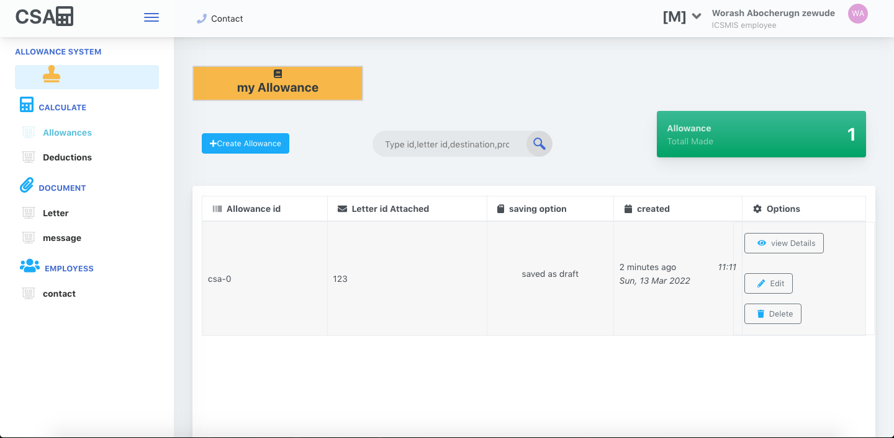

# csa_server: All things about civil service allowance system

> This allowance calculator developed and designed by Metrix technologies helps customers for easy allowance calculations,letter and tems of referecence (tor) managment. It also have an easy integration to do complicated deductions with improved reporting and and stastical method



## Tools used

- Mongoose
- Express
- Node.js
- socket.io

## Live Demo

[Live Demo Link](https://cs-allowance.herokuapp.com/)

## Built With

- Pkg (Bulit for easy distrbution).
- Pm2 (for making the system to service).

### Prerequisites

The basic requirements for building the executable are:

- A working browser application (Google chrome, Mozilla Fire fox, Microsoft edge ...)
- VSCode or any other equivalent code editor
- Node Package Manager (For running, debuging, or installing dependancies to be used)

<br>
<br>

## Available Scripts

In the project directory, you can run:
### `npm install`

Installs basic  dependency for the project.
### `npm start`

Runs the app in the development mode.\
Open [http://localhost:1111](http://localhost:1111) to view it in the browser.

The page will reload if you make edits.\
### `npm run build`

Builds the app for production to the `dist` folder.\
It correctly bundles the app in production mode and optimizes the build for the best performance.

The build is minified and the filenames include the hashes.\
Your app is ready to be deployed!
#### Cloning the project

```
git clone https://github.com/Dagic-zewdu/csa_server.git
```

## Author

👤 **Dagic Zewdu Tilahun**

- GitHub: [@Dagic-zewdu](https://github.com/Dagic-zewdu)
- Twitter: [@dagic4](https://twitter.com/dagic4)
- LinkedIn: [LinkedIn](https://www.linkedin.com/in/dagi-zewdu-21b835215/)

Contributions, issues, and feature requests are welcome!

Feel free to check the [issues page](https://github.com/Dagic-zewdu/csa_server/issues).

## Show your support

Give a ⭐️ if you like this project!

## Acknowledgments

- Ethiopian civil service commision

## 📝 License

This project is [MIT](./MIT.md) licensed.
